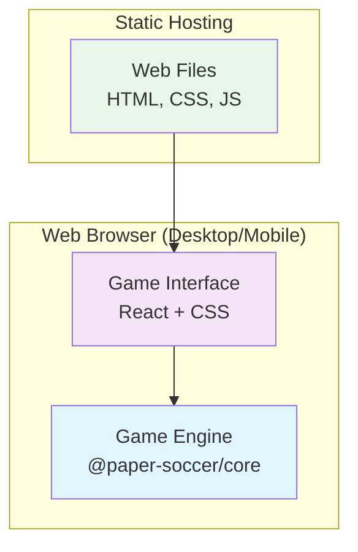

# Design Document: Simple Web-Based Paper Soccer Game

## Overview

This design creates a simple, responsive web-based Paper Soccer game that works perfectly on both desktop computers and mobile devices. The game uses the existing `@paper-soccer/core` engine and focuses on local two-player gameplay with a clean, modern web interface.

The system consists of:
1. **Game Engine** - The existing `@paper-soccer/core` package
2. **Web Interface** - Responsive React application that works on all devices
3. **Simple Deployment** - Static web hosting for easy sharing via URL

## Architecture



### Project Structure

Simple single-package structure:
```
src/
├── components/          # React components
│   ├── GameBoard.tsx   # Main game board
│   ├── GameControls.tsx # Game controls (undo, reset, etc.)
│   ├── PlayerIndicator.tsx # Current player display
│   └── Instructions.tsx # How to play
├── hooks/              # React hooks
│   └── useGame.tsx     # Game state management
├── styles/             # CSS styles
│   └── game.css        # Responsive game styles
├── App.tsx             # Main app component
└── main.tsx            # Entry point
```

## Components and Interfaces

### 1. GameBoard Component

**Purpose**: Renders the Paper Soccer field with responsive touch/mouse interaction.

```typescript
interface GameBoardProps {
  gameState: GameState;
  onMove: (to: Pos) => void;
  disabled?: boolean;
}

export function GameBoard({ gameState, onMove, disabled }: GameBoardProps) {
  // Responsive SVG rendering
  // Touch and mouse event handling
  // Visual feedback for valid moves
  // Clean, modern styling
}
```

### 2. useGame Hook

**Purpose**: Manages game state using the existing game engine.

```typescript
export function useGame() {
  const [engine] = useState(() => new GameEngine(DEFAULT_CONFIG));
  const [gameState, setGameState] = useState(() => engine.getState());
  
  const makeMove = (to: Pos) => {
    const success = engine.makeMove(to);
    if (success) {
      setGameState(engine.getState());
    }
    return success;
  };
  
  const undo = () => {
    const success = engine.undo();
    if (success) {
      setGameState(engine.getState());
    }
  };
  
  const reset = () => {
    engine.reset();
    setGameState(engine.getState());
  };
  
  return {
    gameState,
    makeMove,
    undo,
    reset,
    canUndo: engine.getHistory().length > 0
  };
}
```

### 3. Responsive Design

**Mobile-First Approach**:
- Touch targets minimum 44px (iOS guidelines)
- Responsive breakpoints for different screen sizes
- Prevent zoom and scroll during gameplay
- Optimized for both portrait and landscape

**Desktop Enhancements**:
- Hover effects for better UX
- Keyboard shortcuts (Space for undo, R for reset)
- Larger click targets for precision

## Data Models

### Game State Display

```typescript
interface GameDisplayState {
  currentPlayer: 'Player 1' | 'Player 2';
  gameStatus: 'playing' | 'player1_wins' | 'player2_wins' | 'blocked';
  canUndo: boolean;
  validMoves: Pos[];
  ballPosition: Pos;
}
```

## Correctness Properties

*A property is a characteristic or behavior that should hold true across all valid executions of a system-essentially, a formal statement about what the system should do.*

### Property 1: Responsive Interface Consistency
*For any* screen size or device type, the game interface should remain fully functional and visually appropriate.
**Validates: Requirements 1.1, 1.2, 4.1, 4.2, 4.4**

### Property 2: Move Validation Consistency  
*For any* game move attempt, the validation result should be identical between the UI and the game engine.
**Validates: Requirements 1.3, 2.2**

### Property 3: Game State Display Accuracy
*For any* game state, the UI should accurately reflect the current player, available moves, and game status.
**Validates: Requirements 1.5, 2.1, 2.3**

### Property 4: Touch and Mouse Input Equivalence
*For any* valid move position, both touch input (mobile) and mouse input (desktop) should produce the same game result.
**Validates: Requirements 1.4, 4.1**

## Error Handling

### Input Validation
- Client-side move validation before processing
- Clear visual feedback for invalid moves
- Graceful handling of rapid input events

### Responsive Design Fallbacks
- CSS fallbacks for older browsers
- Progressive enhancement for touch features
- Graceful degradation on small screens

### Performance Optimization
- Efficient re-rendering using React best practices
- Optimized SVG rendering for smooth gameplay
- Minimal bundle size for fast loading

## Testing Strategy

### Unit Tests
- Component rendering and interaction
- Game state management hook
- Responsive design breakpoints
- Touch and mouse event handling

### Property-Based Tests
- Cross-device input consistency
- Game state accuracy across different scenarios
- Responsive layout behavior across screen sizes

**Testing Framework**: Jest + React Testing Library + Fast-check
**Test Configuration**: Minimum 100 iterations per property test